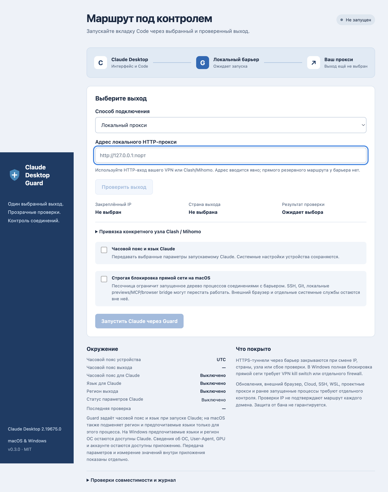

# Claude Desktop Guard

A desktop companion for **Claude Desktop's Code tab on macOS and Windows**. Select your Amnezia VPN interface or local HTTP proxy, inspect its exit, explicitly pin the public IP and country, then launch Claude through a local HTTPS tunnel gate.

**This is a routing and privacy control, not a proven account-ban bypass.** It cannot override server-side account policies or make an unsupported region eligible. No suspension-prevention effectiveness has been measured.



## What it does

- Routes CONNECT traffic exclusively through the local HTTP/HTTPS proxy you select. No direct fallback, TLS interception, request-body rewriting, or OAuth-token collection.
- Supports **AmneziaWG/TUN without a local HTTP proxy**. A bundled native helper binds every IPv4 TCP socket to the selected tunnel's interface index and source address. DNS-over-HTTPS also uses that bound socket; the system DNS resolver is not used. Missing or changed interfaces close the helper and its connections. IPv6 CONNECT targets are rejected in this mode rather than using another route.
- Checks public IP through **ipify and ipinfo**, requires both to agree, and checks ipinfo's country against your explicit pin. Failed probes, a changed exit, or stale checks close active and pending tunnels. It stays locked until an explicit restart.
- Optionally checks the selected **Clash/Mihomo group and final node** through its local controller. Rejects direct, load-balanced, cyclic, missing, or changed selections. It does not edit Mihomo routing rules.
- Installs Claude Desktop's `egressProxyUrl` and Claude Code's upper/lowercase proxy settings through a recoverable local transaction. Restores only owned settings, preserves unrelated edits, and refuses conflicting changes.
- Offers an optional **macOS process sandbox** that allows outbound connections only to the gate's loopback port. This also restricts programs launched within that process tree.
- Applies an explicit **client timezone and language profile** before starting Claude: `TZ`, `LANG`, `LC_ALL`, and Chromium `--lang`. On macOS, process-scoped Cocoa defaults also replace native preferred languages and regional locale. The host timezone and language stay unchanged. The chosen timezone must match the checked exit; a missing or changed GeoIP timezone locks the gate.
- Distinguishes requested launch settings from measurements inside Claude. No debugger port, code injection, vendor binary patch, or TLS interception is used. Full device fingerprint masking is not provided.

## Download

[Releases](https://github.com/w1zardz/claude-desktop-guard/releases) contain Windows x64 portable `.exe`, macOS Apple Silicon `.zip`, and macOS Intel `.zip`, plus SHA-256 hashes. Builds are unsigned and macOS builds are not notarized. Use your platform's normal application approval flow if it blocks the downloaded build.

## Use

1. Install official Claude Desktop, version **1.44121.1 or later**. Quit it completely before launching Guard; Guard does not kill your sessions.
2. Start your existing proxy/VPN software. In **Amnezia VPN** mode, refresh the interface list and explicitly select the active tunnel with its index and IPv4 address. In **Локальный прокси** mode, enter its HTTP listener. SOCKS-only URLs are not accepted; proxy URLs must use loopback without credentials.
3. Click **Проверить выход**. The application does not choose an interface, address, country, account, or VPN node for you.
4. Inspect the observed IP and country. Click **Закрепить этот IP** to accept that exact exit.
5. In local-proxy mode, optionally configure the local Mihomo controller, selector group, and exact final node. Its secret is held in memory for this run and is not saved in the profile. Configure Mihomo itself so Claude traffic uses this group; the controller check alone does not prove every destination follows it.
6. Optionally enable **Часовой пояс и язык Claude**. Use the copy button to take timezone and country from the current exit check; choose the language explicitly. Then click **Запустить Claude через Guard** and use a **Local** Code session. Checks repeat every 10 seconds. A failed check locks the gate; an unavailable or rate-limited probe service therefore interrupts access.
7. Closing Guard's window while the gate runs hides it in the tray. **Остановить барьер** closes its tunnels but leaves Claude pointing at the closed proxy. To return to the previous route, quit Claude and use **Восстановить настройки**. The next Claude launch then uses your previous settings.

## Client environment verification

[Validation results and reproducible checks](docs/client-validation.md) include actual Claude Desktop measurements on macOS and cross-platform Electron tests for renderer/worker timezone, DST, language headers, and child-process inheritance. Guard reports **parameters passed**, not a fictitious runtime measurement.

On Windows, native preferred OS languages and regional APIs remain available to Claude even when Chromium language changes. A Windows OS timezone change can reset Chromium timezone until Claude is relaunched. Saved Desktop UI language can also differ from Chromium language. OS/platform, User-Agent, RAM/device class, GPU, fonts, Canvas/WebGL, TLS and account history are not hidden by this profile.

## Coverage and limits

| Path | Coverage |
|---|---|
| App window, in-app requests, local Code engine | Pinned Desktop proxy plus launch arguments and user Code proxy settings |
| Existing gate tunnels when a probe fails | Closed immediately after the failed check completes |
| Interval between a route change and detection | Up to the check interval/probe timeout; this is not instantaneous route enforcement |
| Every destination behind a per-host proxy rule | Not proven by public-IP probes; test the actual routes separately |
| Amnezia helper connections | IPv4 TCP and encrypted DNS bound to the selected tunnel; IPv6 destinations rejected |
| macOS strict mode | Inherited process sandbox; external/system processes are outside it |
| Windows direct connections | Require an external VPN kill switch or firewall; Guard is not a Windows firewall |
| Desktop updater, system browser OAuth, OS sign-in broker | Separate OS/browser routing must be controlled |
| Cloud, SSH and WSL Code sessions | Not certified by this local companion |
| Server-side account restrictions | Not controlled by this application |

The upstream proxy must be configured to route the relevant traffic consistently. In particular, public-IP probes cannot certify an Anthropic-specific split route. The app never reports account safety or an invisible fingerprint.

Amnezia's **VPN for everything except selected sites** mode has a direct-bypass list. Adding Claude/Anthropic to that list sends them directly; do not add them as a supposed VPN allowlist. Guard does not edit Amnezia preferences, import VPN keys, or run a route-list updater. Its native helper explicitly selects the tunnel for its own sockets, independently of those bypass entries. Reconnecting Amnezia can change the interface identity: refresh, select it again, check the exit and pin it again. The helper deliberately does not recover automatically after its tunnel disappears.

The helper's IPv4 binding uses macOS `IP_BOUND_IF` and Windows [`IP_UNICAST_IF`](https://learn.microsoft.com/en-us/windows/win32/winsock/ipproto-ip-socket-options), plus the tunnel's source address. This controls helper sockets, not arbitrary Claude or OS connections. A Windows WFP policy that covers only Claude's directory does not automatically cover a separate proxy executable. Keep your existing app firewall/kill switch for bypass paths; macOS strict mode restricts the newly launched Claude process tree. No claim of complete manual-disconnect, sleep/wake or network-change certification is made.

The official app has proxy-bypass paths and startup behavior outside the gate's authority. Launcher proxy arguments reduce the initial routing gap but are not a network-layer guarantee. Use OS/network enforcement when direct egress is unacceptable. Strict macOS mode may prevent SSH, direct Git transports, local previews/MCP/browser bridges, or developer programs that ignore HTTP proxy variables from accessing the network.

Project-level `.claude/settings.json` / `.claude/settings.local.json` can override user proxy settings in local claude.ai Code sessions. This tool does not rewrite your project files. Managed-provider sessions have different precedence rules. Pre-existing background supervisors and other processes outside the launched tree also need separate control. See the [official proxy and launcher scope rules](https://code.claude.com/docs/en/network-config).

## Compatibility and configuration safety

The public [Desktop proxy documentation](https://claude.com/docs/third-party/claude-desktop/network-proxy) documents `egressProxyUrl` and its traffic scope. Guard rejects PAC pinning and managed-policy conflicts. Older apps cannot use the pinned key.

The local configuration-library metadata contract was checked against the installed **Claude Desktop 2.19675.0 on 2026-10-03**. Paths and managed precedence are described in [MDM configuration](https://claude.com/docs/third-party/claude-desktop/mdm). Future Desktop changes may require an update to Guard; a minimum version check alone does not establish compatibility with every future release.

Settings touched:

- macOS: `~/Library/Application Support/Claude-3p/configLibrary/`.
- Windows: `%LOCALAPPDATA%\Claude-3p\configLibrary\`.
- Both: `~/.claude/settings.json` proxy/bypass environment keys only.

Transaction backups live in Guard's own user-data directory, not the Git repository. They can contain secrets already present in your settings and are kept local. Restoration preserves unrelated edits that were observed. Malformed JSON, symlinks and detected conflicting concurrent edits stop the transaction. Checks are optimistic: Guard serializes its own operations but cannot lock unrelated editors; close other configuration editors during installation/restoration. A recovery journal remains after a crash. Restoring a previous route is always an explicit action.

## Build and test

Requires Node **22.12 or later** and Go **1.26.8** for development. Installed builds bundle their runtimes and native helper.

```sh
npm ci
npm run helper:build
npm run test:helper
npm run check
npm test
npm run test:ui
npm start
```

On Linux, omit `helper:build` and use `xvfb-run -a npm run test:ui` on a headless runner; Linux is a test platform, not a supported Desktop launch target. `npm run dist -- --mac --arm64` or `--win --x64` builds the corresponding package and helper on its matching native architecture. To build Intel Mac from Apple Silicon, use `CDG_HELPER_ARCH=x64 npm run dist -- --mac --x64`; the helper and Electron architectures must match. Tagged `v*` releases run tests on Windows, macOS and Linux before packaging and publishing binaries.

Tests cover tunnel parsing/TLS/timeout/abort, fail-closed locks, IP consistency, route selection, stale observations, native helper validation and lifecycle, transactional recovery, symlink/path rejection, concurrent edits, startup errors and renderer isolation. They do not prove that an account will avoid suspension or certify a complete live Code session on every Desktop release.

## Inspiration and license

Independent implementation, MIT. See [third-party notes](THIRD_PARTY_NOTICES.md) for reviewed projects and license boundaries. Claude and Anthropic names indicate compatibility; this project is independent.

[Русское описание](README.ru.md)
